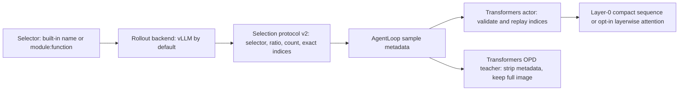

# Final staged architecture for visual-token pruning

Validated branch: `stage/final-vision-pruning-architecture`.

## Decision

Use **Transformers as the training and numerical-reference implementation** and
**vLLM as the default rollout backend**. Do not duplicate selector logic in the
actor. Rollout selects visual-token indices once; the actor validates and
replays exactly those indices; the OPD teacher remains unpruned.

The production default is layer-0 physical pruning because it is the smallest,
fastest, and least version-sensitive path. `prune_after_layer=N` remains an
opt-in research backend for algorithms that need a delayed pruning boundary.
It is not the default because vLLM 0.18 requires eager execution and disabled
chunked prefill, prefix caching, compilation, and CUDA graphs on that path.

This split keeps numerical semantics in ordinary PyTorch/Transformers while
retaining vLLM where it has a measured rollout benefit.

## Measured backend performance

The benchmark used an unpruned Qwen2.5-VL-3B-Instruct in BF16 on one NVIDIA
H20. Every request contained approximately 1,900 input tokens and generated 32
tokens. Image resolution changed the visual-token share while total context
stayed fixed. Transformers used FlashAttention and batched `generate`; vLLM
0.18 used its standard compiled backend, chunked prefill, CUDA graphs, and a
manually bounded 512 MiB KV cache.

| Image | Visual tokens | Batch | Transformers tok/s | vLLM tok/s | Speedup | Transformers peak | vLLM peak |
|---:|---:|---:|---:|---:|---:|---:|---:|
| 224² | 64 | 1 | 31.85 | 157.18 | 4.94x | 8,244 MiB | 8,928 MiB |
| 224² | 64 | 4 | 101.84 | 276.71 | 2.72x | 8,920 MiB | 9,168 MiB |
| 448² | 256 | 1 | 30.89 | 130.38 | 4.22x | 8,266 MiB | 9,170 MiB |
| 448² | 256 | 4 | 102.47 | 278.80 | 2.72x | 8,942 MiB | 9,290 MiB |
| 896² | 1,024 | 1 | 30.37 | 103.47 | 3.41x | 8,478 MiB | 9,290 MiB |
| 896² | 1,024 | 4 | 88.52 | 279.88 | 3.16x | 9,628 MiB | 9,290 MiB |

vLLM decode latency was 3.43 ms/token at batch 1 and 5.40-5.55 ms/token at
batch 4. Transformers required 27.90-28.86 ms/token at batch 1 and
31.67-33.37 ms/token at batch 4. vLLM therefore improved decode latency by
about 5.7-8.4x. TTFT was much closer: depending on resolution and batch, vLLM
was slightly slower or up to about 40% faster. The main benefit is continuous
decode and concurrent rollout throughput, not every single prefill.

The vLLM process used roughly 0.7-0.9 GiB more memory for batch 1, including
the explicit 512 MiB KV allocation. At batch 4 the peak difference ranged from
338 MiB lower to 348 MiB higher than Transformers. The memory cost is acceptable
on the tested H20 and is small relative to its throughput gain.

The wall-time comparison is conservative for vLLM: vLLM prompt rendering was
inside the measured call, while Transformers inputs were preprocessed before
timing. Model loading and vLLM's one-time 8-19 second compile/startup cost were
excluded from steady-state cases. That startup cost matters for one-off local
debugging but is amortized by verl rollout workers.

Reproduce the measurements by running each backend in a separate process:

```bash
python scripts/benchmark_rollout_backends.py transformers \
  --model /path/to/Qwen2.5-VL-3B-Instruct \
  --output /tmp/transformers.json

python scripts/benchmark_rollout_backends.py vllm \
  --model /path/to/Qwen2.5-VL-3B-Instruct \
  --output /tmp/vllm.json
```

## Reproducing the acceptance run

On a CNB GPU workspace, prepare the model and synthetic smoke data:

```bash
git clone https://cnb.cool/ai-models/Qwen/Qwen2.5-VL-3B-Instruct \
  /root/models/Qwen2.5-VL-3B-Instruct
python scripts/create_vision_opd_smoke_data.py \
  --output-dir /root/opd-smoke-data --samples 16 --resolution 224
```

Validate real batch-2 rollout and direct three-step actor optimization first:

```bash
python scripts/gpu_e2e_smoke.py rollout \
  --model /root/models/Qwen2.5-VL-3B-Instruct \
  --output-dir /root/final-uniform-direct \
  --selector uniform --keep-ratio 0.5 --prune-after-layer 15 \
  --batch-size 2

python scripts/gpu_e2e_smoke.py train \
  --output-dir /root/final-uniform-direct --steps 3
```

Then run the complete verl path. CPU offload is explicitly disabled for the
validated CNB PyTorch 2.10 image because its asynchronous offload path raised a
CUDA invalid-argument error before pruning execution:

```bash
MODEL_PATH=/root/models/Qwen2.5-VL-3B-Instruct \
TRAIN_FILE=/root/opd-smoke-data/train.parquet \
OUTPUT_DIR=/root/final-uniform-ppo \
KEEP_RATIO=0.5 SELECTOR=uniform PRUNE_AFTER_LAYER=15 \
TOTAL_TRAINING_STEPS=3 SAVE_FREQ=3 RESUME_MODE=disable \
bash scripts/run_vision_opd_10step_smoke.sh \
  actor_rollout_ref.actor.fsdp_config.param_offload=False \
  actor_rollout_ref.actor.fsdp_config.optimizer_offload=False \
  actor_rollout_ref.ref.fsdp_config.param_offload=False

python -m pytest tests/vision_token_pruning -q
```

## Architecture



There are four intentionally small boundaries:

1. `selectors.py` owns only the algorithm that returns retained indices.
2. The vLLM plugin owns physical rollout compaction and selection transport.
3. `VisionTokenSelection` is the only rollout-to-training wire contract.
4. The Transformers actor owns validation and exact replay; it never reruns an
   algorithm and the teacher never sees pruning metadata.

Consequently, a selector cannot silently diverge between rollout and training.
Protocol v2 records the selector name, keep ratio, original token count, and
sorted retained indices. The actor checks all four before its forward pass.

## Adding an algorithm

Two selectors are included:

- `random`: seedable random retention with the final MRoPE anchor preserved;
- `uniform`: spatially uniform retention with the same anchor rule.

For an external algorithm, expose one installed Python function and configure
its import path:

```python
def select_tokens(
    token_count,
    keep_count,
    *,
    device,
    generator,
    features,
    grid_thw,
):
    # Return a sorted, unique integer tensor with exactly keep_count entries.
    # The last entry must be token_count - 1 (the MRoPE anchor).
    ...
```

```yaml
vision_token_pruning:
  enabled: true
  keep_ratio: 0.5
  selector: my_package.my_selector:select_tokens
  prune_after_layer: -1
```

The same string reaches the spawned vLLM worker, so no actor, teacher,
AgentLoop, or backend modification is required. The selector receives visual
features and `grid_thw`, which supports random, uniform, similarity,
diversity, saliency, clustering, and other vision-encoder-based methods.
Algorithms that require decoder-layer hidden states need an additional
backend hook, but they can keep the same selection protocol and actor replay.

## Operational defaults

- Long-running verl rollout or `n > 1`: use vLLM.
- Single-request debugging or numerical reference: use Transformers.
- General algorithm work: start with layer-0 physical pruning.
- Delayed-boundary research: set `prune_after_layer=N` and accept eager vLLM.
- Always keep the OPD teacher unpruned.
- Keep `use_remove_padding=True` for layer-0 actor training.
- Pin PyTorch 2.10.0, Transformers 4.57.6, and vLLM 0.18.0 for the validated
  implementation.
- On CNB, clone Qwen2.5-VL directly from the internal mirror instead of using
  a Hugging Face download API:

  ```bash
  git clone https://cnb.cool/ai-models/Qwen/Qwen2.5-VL-3B-Instruct \
    /path/to/Qwen2.5-VL-3B-Instruct
  ```

## Risks and containment

- **vLLM private API churn:** the out-of-tree attention backend depends on
  vLLM 0.18 internals. Keep vLLM behind the rollout adapter and pin its version.
- **Layerwise optimization loss:** eager mode removes several vLLM advantages.
  Treat layerwise mode as research-only until a stable backend API exists.
- **Metadata transport conflict:** selection currently uses the routed-expert
  return channel and cannot run with rollout routing replay.
- **Model coverage:** layerwise mode is validated only for Qwen2.5-VL;
  layer-0 mode also supports Qwen3-VL.
- **FSDP CPU offload on the CNB image:** asynchronous parameter offload raised
  a CUDA invalid-argument error before pruning execution. Disable actor/ref
  parameter and optimizer offload on that image.
- **Custom selector availability:** a `module:function` selector must be
  installed in every rollout worker environment. Import and output validation
  fail early with explicit errors.

## Validation status

The staged selector architecture passed the following checks on one NVIDIA
H20 with Qwen2.5-VL-3B-Instruct in BF16:

- the focused pruning suite completed with `47 passed, 1 skipped`;
- layerwise compact attention was bitwise equal (`rtol=0`, `atol=0`) to
  unmodified Transformers FlashAttention with the same ordinary 2-D attention
  mask at boundaries 0, 1, and 2, including retained hidden states, loss, and
  every parameter gradient;
- a real batch-2 layerwise vLLM rollout used the `uniform` selector at boundary
  15, retained 32 of 64 image tokens per request, and decoded 18 tokens for
  both requests while returning the exact selection metadata;
- direct Transformers actor training replayed that same uniform selection for
  three optimizer steps. Losses were `0.0010258578`, `0.0010284528`, and
  `0.0010237512`; gradient norms were approximately `0.00662-0.00665`; the
  final evaluated loss was `0.0009053792`; and the selected parameter changed
  by norm `0.02569315`;
- the full Ray + FSDP + vLLM + AgentLoop + unpruned OPD teacher + rank-8 LoRA
  path completed all three global steps and saved `global_step_3`. VOPD losses
  were `0.0123539856`, `0.0205113254`, and `0.0159867015`; gradient norms were
  `0.13905214`, `0.10585070`, and `0.09051592`; policy/GRPO fallback and
  empty-target fractions stayed zero; teacher and image-swap fractions stayed
  one; peak allocated GPU memory was `23.17385 GiB`;
- the saved adapter contained 252 LoRA-A and 252 LoRA-B tensors. All 8,257,536
  LoRA-B elements were nonzero and their combined norm was `0.06206261`, which
  confirms a persisted optimizer update.

The numerical claim is deliberately scoped. The Transformers training path's
prefill/loss/gradient equivalence to the ordinary attention-mask reference is
proved bitwise. The vLLM path has real prefill, KV-cache layout, multi-request
decode, and end-to-end training evidence, but this stage does **not** claim
full-vocabulary, token-by-token logit identity between vLLM and Transformers.
Different fused kernels and execution orders make bitwise cross-engine output
an inappropriate release gate. A bounded-error top-k/log-probability comparison
is retained as a research gate before promoting the eager layerwise backend
from experimental to production.

The complete run log, three rollout records, and final adapter are archived in
`artifacts/final-vision-pruning/`. The adapter SHA-256 is
`c821e0be332e0d98120a521fc2b9565c1ab326d9c372f2facc4fc5319ea7eede`.

## Staged conclusion

The acceptance target for this branch is met: real rollout, actor/teacher
forward passes, backward passes, optimizer updates, three global training
steps, and checkpoint persistence all succeed with finite metrics and valid
selection metadata. Use the layer-0 selector architecture for normal
experiments; keep layerwise pruning behind an explicit research option.

Do not add random decode-time KV dropping to this release. Dropping arbitrary
prompt KV entries after prefill changes model semantics, and doing it only
after a decoder boundary introduces a second layer-dependent cache layout. At
roughly 2K context it can reduce decode attention work, but it cannot reduce
the decoder MLP cost and may lose its benefit when the required eager vLLM
mode disables compilation and CUDA graphs. The next-stage experiment should
first define a deterministic cache-selection protocol, compare each decode
step against a Transformers masked-attention reference, and benchmark the
end-to-end trade-off before integration.
