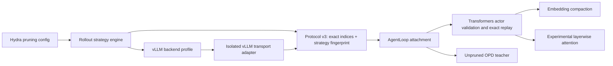

# Visual-token pruning experiment platform

Milestone branch: `milestone/vision-pruning-experiment-platform`.

## Architecture decision

The stable experiment architecture has one owner for each responsibility:



The selector executes exactly once in the rollout worker. The actor never
imports or reruns it: it checks the configured strategy fingerprint and
replays the returned indices. This makes stochastic, feature-based, and future
learned selection methods use the same actor, teacher, and AgentLoop code.

The layers are deliberately small:

1. `strategy.py` defines the public request API, registry, dynamic import,
   deterministic seeding, and output validation.
2. `protocol.py` is the backend-neutral wire record. Protocol v3 stores the
   exact indices and a SHA-256 identity of the strategy name and options.
3. `transport.py` contains the temporary vLLM 0.18 embedding/routed-expert
   metadata codec. No stable layer depends on vLLM internals.
4. `training.py` validates rollout identity, prepares actor inputs, and strips
   every pruning field from the teacher.
5. `embeddings.py` contains only model-facing physical compaction.
6. `backends.py` owns model support and vLLM launch constraints.
7. Actor, AgentLoop, Qwen, and rollout-server call sites are thin adapters.

## Stable, experimental, and rejected paths

| Status | Path | Intended use |
|---|---|---|
| Stable default | Layer-0 physical pruning | General algorithm and training experiments |
| Stable reference | Ordinary Transformers attention mask | Numerical correctness, loss, and gradient checks |
| Stable rollout | vLLM physical backend | Concurrent training rollouts and normal long-running experiments |
| Experimental | `prune_after_layer=N` | Research that requires full early decoder layers |
| Rejected from core | Dynamic decode-time image-KV top-k | Correct in isolation but slower on the tested vLLM eager path |

Transformers remains the training implementation and numerical oracle. For
unpruned inference, standard compiled vLLM remains the rollout backend because
the existing H20 benchmark measured a 2.7-4.9x end-to-end throughput advantage
around 2K input context and a 5.7-8.4x decode-latency advantage. Its startup and
roughly 0.7-0.9 GiB batch-1 memory premium are acceptable for persistent verl
workers. The current exact-selection training plugin must use eager vLLM for
its metadata hook, so those compiled-backend speedups must not be attributed to
the pruned path. Use Transformers for one-off debugging and exact numerical
comparisons.

## Adding a strategy

A new strategy is one importable function. It receives all rollout-only data
through a typed request and returns sorted, unique retained indices:

```python
import torch

from verl.models.vision_token_pruning.strategy import VisionTokenSelectionRequest


def select_tokens(request: VisionTokenSelectionRequest) -> torch.Tensor:
    strength = float(request.options.get("strength", 1.0))
    scores = request.features.float().norm(dim=1) * strength
    return scores.topk(request.keep_count).indices.sort().values
```

Configure it as `my_package.my_module:select_tokens` and pass JSON-compatible
options through `selector_kwargs`. The options participate in the protocol
fingerprint, so the actor rejects a rollout from the same function configured
differently. A working feature-norm example is in
`examples/vision_token_pruning/custom_strategies.py`.

The output contract is enforced centrally:

- exactly `round(token_count * keep_ratio)` indices, with a minimum of one;
- rank-1 integer tensor on the requested device;
- sorted, unique, in range;
- no fixed anchor token is required; any sorted valid subset is accepted.

The old flat two-argument selector functions and public names in `selectors.py`
remain compatibility wrappers. Existing `module:function` selectors continue
to work while new code should use `VisionTokenSelectionRequest`.

## Running experiments

On CNB, use the internal model mirror:

```bash
git clone https://cnb.cool/ai-models/Qwen/Qwen2.5-VL-3B-Instruct \
  /root/models/Qwen2.5-VL-3B-Instruct
```

Run the stable physical backend:

```bash
MODEL_PATH=/root/models/Qwen2.5-VL-3B-Instruct \
TRAIN_FILE=/root/opd-smoke-data/train.parquet \
OUTPUT_DIR=/root/physical-embedding-norm \
KEEP_RATIO=0.5 SELECTOR=embedding_norm PRUNE_AFTER_LAYER=-1 \
TOTAL_TRAINING_STEPS=3 RESUME_MODE=disable \
bash scripts/run_vision_pruning_experiment.sh
```

Run the experimental layerwise backend:

```bash
MODEL_PATH=/root/models/Qwen2.5-VL-3B-Instruct \
TRAIN_FILE=/root/opd-smoke-data/train.parquet \
OUTPUT_DIR=/root/layerwise-uniform \
KEEP_RATIO=0.5 SELECTOR=uniform PRUNE_AFTER_LAYER=15 \
TOTAL_TRAINING_STEPS=3 RESUME_MODE=disable \
bash scripts/run_vision_pruning_experiment.sh
```

Run the external request-based example with an option:

```bash
SELECTOR=examples.vision_token_pruning.custom_strategies:feature_norm \
SELECTOR_KWARGS='{channel_start:8}' \
bash scripts/run_vision_pruning_experiment.sh
```

`vision_pruning_experiment.yaml` contains the reproducible single-H20 LoRA,
OPD-teacher, rollout, and memory settings. The launcher exposes only paths,
strategy/backend choices, step/save/resume controls, and arbitrary final Hydra
overrides. `SELECTOR_KWARGS` is optional and uses Hydra's compact mapping syntax.
The historical `run_vision_opd_10step_smoke.sh` is now a compatibility
wrapper around this entry point.

## Constraints and risk containment

- Exactly one image and no video are supported per pruned rollout.
- Physical mode supports Qwen2.5-VL and Qwen3-VL. The two-stage physical
  prefill plus dynamic Flex decode mode has real rollout/training validation
  on both Qwen2.5-VL-3B and dense Qwen3-VL-4B.
- Exact selection capture currently requires eager vLLM for both backends:
  compiled graph replay does not re-enter the Python metadata hook. Layerwise
  mode additionally disables chunked prefill and prefix caching.
- Layerwise actor training currently requires sequence-parallel size one.
- The vLLM 0.18 selection transport uses the routed-expert return channel and
  cannot run with routing replay.
- Custom strategy modules must be importable in every spawned rollout worker.
- Pin vLLM 0.18.0 and Transformers 4.57.6; private vLLM details are contained
  in the plugin and `transport.py` but are still version-sensitive.
- The validated CNB PyTorch 2.10 environment must keep actor/ref FSDP CPU
  offload disabled; the experiment preset already does so.
- Decode-time image-KV dropping is not part of this milestone. The separate
  exact top-5% prototype preserved its stated masked-attention semantics but
  was about 2.5x slower at batch four because eager-mode indexing overhead and
  lost graph optimizations outweighed the smaller attention matrix.
- A compiled physical rollout was explicitly tested and rejected: the first
  graph capture bypassed the per-request Python metadata lifecycle on replay,
  and the plugin correctly failed with a stale-metadata error instead of
  silently returning the wrong selection. Eager-only is therefore an enforced
  correctness constraint, not an incidental smoke-test setting.

## Acceptance gates

The milestone is released only after all of the following pass on the pinned
H20 stack:

- focused unit/source/runtime suite;
- physical random and uniform real vLLM rollouts;
- an importable request-based strategy with non-empty `selector_kwargs`;
- batch-2 layerwise rollout;
- bitwise Transformers attention-mask equivalence for retained states, loss,
  and parameter gradients at multiple layer boundaries;
- three direct actor optimizer steps with finite loss and non-zero update;
- three full Ray/FSDP/vLLM/AgentLoop/OPD-teacher LoRA steps;
- saved LoRA-B tensors containing non-zero values.

The final commands, versions, metrics, and artifact checksums are recorded in
the milestone commit after the H20 run.

## H20 milestone evidence

The final branch was validated on one NVIDIA H20 with PyTorch 2.10,
Transformers 4.57.6, vLLM 0.18.0, and the CNB-mirrored
Qwen2.5-VL-3B-Instruct. Another process occupied approximately 35 GiB and often
reported 100% GPU utilization, so this run is a correctness/training gate, not
a replacement for the isolated performance table in the staged architecture
report.

- Ruff, Python compilation, shell syntax, Hydra composition, and diff checks
  passed. The focused suite reported `72 passed, 1 skipped`; the skip is the
  optional vLLM source-tree contract.
- The strict Transformers numerical reference ran three layer boundaries and
  reported `3 passed`. Retained hidden states, scalar loss, and every parameter
  gradient were bitwise equal (`rtol=0`, `atol=0`) to ordinary Transformers
  FlashAttention driven by a 2-D attention mask.
- Physical random rollout retained 32/64 image tokens and decoded 18 tokens.
  Physical uniform batch-2 rollout retained 32/64 for both requests and decoded
  18 tokens for each.
- The external `feature_norm` request strategy ran in a real spawned vLLM
  worker with `selector_kwargs={channel_start: 8}`, retained 32/64 tokens, and
  decoded 18 tokens. Its exact selection then completed three direct actor
  updates: losses were `0.00349945`, `0.00349052`, and `0.00348640`; gradient
  norm was `0.0202637`; post-update loss was `0.00347450`; and the selected
  parameter changed by norm `0.0260625`.
- Experimental layerwise uniform batch-2 rollout completed at layer 15 and
  returned exact metadata for both requests. Three direct actor steps had
  losses `0.00102586`, `0.00102845`, and `0.00102375`; final evaluated loss
  `0.000905379`; and parameter delta norm `0.0256932`.
- The new one-command preset completed three full
  Ray/FSDP/vLLM/AgentLoop/unpruned-OPD-teacher steps with the external
  feature-norm strategy. VOPD losses were `0.00588185`, `0.00961784`, and
  `0.00919401`; gradient norms were `0.0576869`, `0.113609`, and `0.137955`.
  Teacher activation stayed 1.0, policy fallback stayed 0.0, and peak allocated
  GPU memory was 23.17385 GiB.
- `global_step_3` contains 252 LoRA-B tensors. All 8,257,536 values are nonzero,
  their combined norm is `0.0664404`, and the adapter SHA-256 is
  `6b5b2064d0b4798e09b7abe5666ff0095e0c011fda6cc18da4a50feda5032105`.

These gates establish both numerical semantics and operational viability. The
release recommendation remains physical pruning for normal experiments,
layerwise pruning only when an algorithm genuinely needs early full-token
layers, vLLM for persistent rollout, and Transformers for training/reference.
