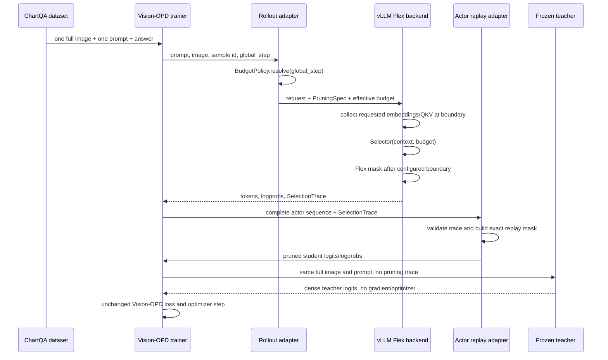

# Vision-OPD visual-token pruning refactoring proposal

Status: design proposal only. This document does not authorize or include a
runtime refactor.

Date: 2026-07-21

## 1. Executive recommendation

The current implementation should not be rewritten from scratch. Its most
important boundary is already correct:

```text
selector -> rollout selection trace -> AgentLoop transport
         -> actor exact replay -> unpruned/frozen OPD teacher
```

The original Vision-OPD trainer is not the main source of complexity. The
largest maintenance burden comes from keeping several research backends,
several selection protocols, compatibility facades, benchmark-only code, and
raw experiment outputs together in the main branch.

The recommended target is therefore:

1. Keep Vision-OPD's OPD loss, reward, Ray trainer, frozen teacher semantics,
   and exact rollout-to-actor replay unchanged.
2. Make one static physical backend and one Flex mask backend the only
   supported main-line paths.
3. Expose one strategy API and one canonical training configuration.
4. Move compact-Flash, Transformers sampler, large benchmarks, advanced
   dynamic/two-stage experiments, and raw artifacts out of the default path.
5. Introduce a compatibility translator before changing the current wire
   protocol or public configuration.

For the current random/embedding selector, layer-0 boundary, and step-based
curriculum experiments, this low-risk cleanup is enough. A larger StageSpec and
SelectionTrace redesign is useful only when learned budgets, per-query routing,
or arbitrary multi-stage pruning become the active research focus.

## 2. Current-state audit

### 2.1 Size and location of complexity

Relative to the original Vision-OPD baseline (`c8a8fdd`), the pruning runtime
adds roughly 5,100 lines under `verl/`. Direct edits to the original trainer,
worker, AgentLoop, and rollout-server files are much smaller: approximately
170 lines, plus about 280 lines of Qwen2/Qwen3 attention and embedding patches.

The largest runtime files are:

| File | Approximate lines | Current responsibilities |
|---|---:|---|
| `verl/vllm_plugins/layerwise_flex_vision_token_pruning.py` | 958 | Flex attention, slot sidecar, Qwen adapters, static/dynamic/two-stage selection, capture transport, runtime budgets |
| `verl/vllm_plugins/layerwise_vision_token_pruning.py` | 518 | Compact-Flash research backend |
| `verl/models/vision_token_pruning/training.py` | 452 | Actor replay for static, dynamic, and two-stage modes |
| `verl/models/vision_token_pruning/strategy.py` | 449 | Strategy registry, request construction, built-in research methods |
| `verl/models/vision_token_pruning/transformers_sampler.py` | 446 | Standalone benchmark/evaluation sampler, not the OPD training path |
| `verl/models/vision_token_pruning/config.py` | 309 | Generic config plus method-specific validation for every experiment type |
| `verl/models/vision_token_pruning/protocol.py` | 276 | Three different wire schemas |
| `verl/vllm_plugins/vision_token_pruning.py` | 277 | Physical pruning model and metadata transport |

This distribution is encouraging: the original Vision-OPD flow has not been
replaced. Most complexity is already in new packages and can be isolated
without changing OPD mathematics.

### 2.2 What is already well designed

The following boundaries should be preserved:

- Rollout chooses tokens; actor training replays exact indices rather than
  running the selector again.
- Teacher input is stripped of pruning metadata and remains dense.
- The fixed teacher has no optimizer, is in evaluation mode, and is not
  updated by EMA/progressive synchronization.
- Strategy implementations do not manipulate paged-KV addresses.
- FlexAttention owns logical masking while vLLM continues to own paged cache,
  slot mapping, batching, and cache writes.
- Training-step curriculum is independent of the selection algorithm.

### 2.3 Main sources of avoidable complexity

#### Multiple overlapping public APIs

`strategy.py` is the real strategy API, while `selectors.py` and `runtime.py`
are compatibility facades. They increase the number of entry points without
adding current production behavior.

#### Configuration mixes algorithms and backend implementation

The public config currently combines:

- `selector`, `selector_input`, and method-specific `selector_kwargs`;
- `keep_ratio_schedule`, which is based on optimizer `global_step`;
- `selector_kwargs.budget_schedule`, which advances by model-forward count;
- `prefill_*` duplicates of the main selector and budget fields;
- `layerwise_backend` and `pre_pruning_backend`, which are implementation
  details rather than normal experiment choices;
- the magic boundary value `-1`.

This is the largest obstacle to quickly defining a new experiment.

#### Three protocols mirror three implementations

Static, dynamic decode, and two-stage pruning have separate dataclasses,
transport decoders, and actor replay branches. This works, but every new
learned or variable-budget method tends to add another config/protocol/replay
branch even though the actor only needs exact indices.

#### Flex plugin owns too many layers

The current 958-line Flex plugin includes the attention backend, Qwen model
integration, selection runtime, dynamic VisionPulse equations, metadata
capture, curriculum state, and optional pre-boundary Flash execution. These
responsibilities should not share one file.

#### Research and release assets share the main branch

Large benchmark scripts, raw H20 JSON/JSONL files, logs, and multiple overlapping
validation documents make the branch difficult to review. Raw artifacts should
not define the structure of the training product.

#### Unrelated compatibility changes are mixed with pruning

The history also contains Transformers-5.x processor/MRoPE fixes, FLOPs
accounting compatibility, LoRA detection changes, and resource/launcher
cleanup. These may be useful, but they should be independently testable and
versioned. A future Transformers or Qwen upgrade should not require reviewing
the pruning algorithm at the same time.

The global `vllm.general_plugins` entry point and the repository-wide
Transformers pin are also broader than the experiment. A normal Vision-OPD
startup should not import and register eight pruning model aliases. Keep the
original dependency profile intact and provide a pruning-specific constraints
file/environment; load the pruning plugin explicitly from the pruning launcher
or register only the one selected canonical backend lazily.

## 3. Semantic issues that the refactor must make explicit

### 3.1 “Layer 0” currently has two meanings

- `prune_after_layer=-1`: select before decoder layer 0 and physically shorten
  the prompt. This is the simplest path and provides real sequence/KV savings.
- `prune_after_layer=0`: layer 0 sees every visual token; selection is observed
  after layer 0 and applied from layer 1. This requires the layerwise backend.

The current `selection_layer` presentation can label both as layer 0. A new
config should use explicit observation and application boundaries instead of
the `-1` sentinel.

For random or vision-embedding strategies that do not require layer-0 hidden
states, the default experiment can use the physical “before layer 0” path. If
the scientific question requires layer 0 to see the full image, the static Flex
path must remain available. These two semantics must never be silently swapped.

### 3.2 Curriculum masking is not physical acceleration

The current single-process 50% -> 10% -> 5% curriculum changes a Flex mask.
It does not dynamically shrink vLLM prompt placeholders or paged KV allocation.
Physical pruning currently needs an engine-time fixed layout. The public config
must therefore distinguish:

- `flex_mask`: research semantics, arbitrary runtime budget, no physical
  memory/MLP saving claim;
- `physical_fixed`: real sequence/KV reduction, fixed engine budget;
- a future compiled physical backend, only after the algorithm is stable.

The supported-combination table should make this visible:

| Experiment goal | Recommended runtime | Variable budget in one run? | Physical speed/memory claim? |
|---|---|---:|---:|
| Fast selector/OPD algorithm iteration | `flex_mask` | yes | no |
| Exact “layer 0 sees full image” semantics | `flex_mask` | yes | no |
| Final fixed-budget acceleration | `physical_fixed` | no | yes |
| Arbitrary-layer physical compaction | separate performance branch | eventually | only after dedicated validation |

In particular, `physical_fixed` must reject a step curriculum rather than
silently accepting a schedule that its placeholder/cache layout cannot honor.

### 3.3 Current curriculum state is model-global

`global_step` is carried through a private sampling field and each generate
request broadcasts `set_vision_token_pruning_keep_ratio()` to workers. This is
correct for synchronous batches in which every request uses the same step, but
it repeats RPCs and can race if different-step requests overlap.

The low-cost improvement is to cache `(global_step, keep_ratio)` in the rollout
server and update workers once per new step under a lock. The ideal interface
is a batch-level `rollout_adapter.set_step(step)` call before generation.

### 3.4 Random selection should be stateless

The current strategy engine seeds random selection using a mutable selection
counter. Async scheduling or a different batch size can therefore change the
selected tokens. A research API should derive its seed from stable data:

```text
hash(base_seed, global_step, sample/request id, stage name)
```

This makes random baselines reproducible across batch sizes and concurrency.

## 4. Target public experiment interface

### 4.1 Immediate low-risk interface

The first refactor should expose only the fields an algorithm researcher needs:

```yaml
vision_token_pruning:
  enabled: true
  runtime: flex_mask
  boundary:
    observe: after_decoder_layer
    layer: 0
    apply_from_layer: 1
  policy: random
  policy_kwargs: {}
  budget:
    type: piecewise_linear
    milestones:
      - [1, 0.50]
      - [80, 0.10]
      - [100, 0.05]
```

Backend details such as capture capacity, attention implementation, chunked
prefill, and prefix caching belong in an advanced backend preset. The user
should not need to set both `policy=random` and
`selector_input=vision_embedding`; the policy declares its required input.

The existing configuration should remain accepted through a translator during
one compatibility release.

### 4.2 Minimal strategy API

An algorithm author should implement one callable and not modify config.py,
vLLM, actor replay, teacher code, or OPD trainer code.

```python
@dataclass(frozen=True)
class SelectionContext:
    request_id: str
    global_step: int
    phase: Literal["vision", "prefill", "decode"]
    layer: int | None
    visual_embeddings: Tensor | None = None
    query: Tensor | None = None
    key: Tensor | None = None
    value: Tensor | None = None
    context_key: Tensor | None = None
    visual_mask: Tensor | None = None
    generator: Generator | None = None


@dataclass(frozen=True)
class SelectionDecision:
    kept_indices: Tensor
    metrics: Mapping[str, float] = field(default_factory=dict)


class Selector(Protocol):
    input_kind: Literal["vision_embedding", "boundary_qkv", "decode_qk"]

    def __call__(
        self,
        context: SelectionContext,
        budget: BudgetDecision,
    ) -> SelectionDecision: ...
```

The runtime resolves the budget and obtains the tensors declared by
`input_kind`. Policy-specific option validation belongs to the policy class,
not the framework config.

### 4.3 Future multi-stage interface

Only after dynamic/two-stage research becomes central should the public config
be generalized to a list of stages:

```yaml
vision_token_pruning:
  runtime: flex_mask
  stages:
    - name: prefill_once
      observe: {kind: after_decoder_layer, layer: 7}
      apply_from_layer: 8
      policy: embedding_norm
      budget: {type: fixed, keep_ratio: 0.50}

    - name: decode_query
      observe: {kind: decode_query, layer: 15}
      apply_from_layer: 16
      policy: vision_pulse
      budget: {type: fixed, keep_ratio: 0.10}
```

This replaces the flat `prefill_*` duplication. It should not be the first
refactoring step because it changes the most tested protocol and replay code.

## 5. Expected training flow after refactoring



### Detailed invariants

1. Dataset conversion stores or reconstructs exactly one full chart input.
2. Student and teacher receive identical image pixels and instruction text.
3. Only the student rollout invokes a selector.
4. The effective budget is resolved once from `global_step` and recorded in the
   trace.
5. Actor never imports or calls the selector; it validates and replays indices.
6. Core trace validation checks sorted/unique/in-range indices and a complete
   experiment fingerprint. Fixed-budget count validation belongs to the fixed
   budget policy, not to the generic wire protocol.
7. Teacher adapter removes all pruning metadata and executes under no-grad/eval.
8. OPD reward, advantage, distillation loss, and optimization remain unchanged.
9. Metrics include observed token count, retained token count, effective ratio,
   boundary, policy id, and schedule step.

## 6. Proposed file structure

The package should remain under `verl/experimental` to make its out-of-tree
research status explicit while keeping tiny hooks in the original framework.

```text
verl/
  experimental/
    vision_pruning/
      api.py                 # SelectionContext, SelectionDecision, SelectionTrace
      config.py              # small public PruningSpec + legacy config translator
      budget.py              # fixed, piecewise-linear, learned budget interfaces
      registry.py            # stateless selector registry and loading
      policies/
        random.py
        embedding_norm.py
        vision_pulse.py      # optional advanced policy
      replay.py              # actor exact replay and teacher metadata stripping
      bridge.py              # AgentLoop/DataProto integration only
      backends/
        vllm_flex.py         # Flex mask, paged-slot sidecar, runtime state
        vllm_physical.py     # fixed physical compaction path
        qwen_actor.py        # conditional Transformers/Qwen actor adapter
      plugin.py              # canonical vLLM model registration

verl/
  experimental/agent_loop/agent_loop.py        # generic trace pass-through hook
  workers/actor/dp_actor.py                     # one prepare/replay call
  workers/rollout/vllm_rollout/vllm_async_server.py  # rollout adapter hook

verl/trainer/config/
  chartvqa_opd.yaml          # dataset, fixed teacher, OPD defaults
  pruning/
    random_before_l0.yaml
    random_after_l0.yaml
    anneal_50_10_5.yaml
    advanced_dynamic.yaml
  tuning/
    full.yaml
    lora_smoke.yaml

scripts/
  prepare_chartvqa_opd.py
  train_chartvqa_opd.sh      # the only production launcher

tools/vision_pruning/
  benchmarks/               # latency, parity, Transformers sampler utilities
  archived_backends/        # compact-Flash and old compatibility implementations

tests/vision_pruning/
  unit/                      # budget, selector, trace, config
  integration/               # rollout -> actor replay, teacher stripping
  gpu/                       # native Flex and one-step H20 smoke

docs/vision-pruning/
  README.md                  # user workflow and experiment configuration
  design.md                  # backend and trace invariants
  results/                   # small summaries only; raw artifacts stored elsewhere
```

This is a logical target structure. The first migration should preserve import
compatibility and avoid moving every file in one commit.

## 7. Current-file disposition

| Current file/group | Recommendation |
|---|---|
| `config.py` | Keep, but shrink to common fields; move policy-specific validation into policies and add a legacy translator |
| `strategy.py` | Keep as the canonical registry; make selection stateless and unify vision/boundary/decode calls |
| `selectors.py`, `runtime.py` | Deprecate compatibility facades, then remove after one release |
| `curriculum.py`, dynamic budget code | Merge into `budget.py`; clearly separate global-step schedules from data-dependent per-query budgets |
| `protocol.py`, `transport.py` | Preserve initially; later converge on one `SelectionTrace` with rows/stages rather than three protocol classes |
| `training.py` | Preserve the single actor boundary; move advanced replay into research modules and keep static replay small |
| `transformers_sampler.py` | Move to benchmark tooling; it is not used by the training main path |
| `layerwise_flex_vision_token_pruning.py` | Keep the backend, split attention/runtime from Qwen/model/capture integration |
| `layerwise_vision_token_pruning.py` | Move compact-Flash implementation out of the default main path |
| `vision_token_pruning.py` physical plugin | Keep as the fixed-budget performance path; share metadata/Qwen adapter code with Flex |
| `register.py` | Register only canonical model classes; move old random architecture aliases to a compatibility plugin |
| Qwen2/Qwen3 pruning edits | Move into a conditional `qwen_actor` installer; original model files retain only a small opt-in hook |
| ChartQA full/LoRA YAML | Compose one ChartQA config with small full/LoRA tuning overlays |
| three ChartQA/pruning launchers | Replace with one launcher; schedule and policy are YAML/CLI overrides |
| benchmark scripts and raw artifacts | Move under tools/results branch; keep only small summaries and reproduction commands in main |
| `main_ppo.py` / `ray_trainer.py` compatibility edits | Restore baseline behavior where possible; keep fixed-teacher freeze and version helpers in separate commits |

## 8. Minimal Vision-OPD integration surface

The target should retain only three pruning-specific integration points in
original framework files:

1. AgentLoop/TokenOutput carries one generic `SelectionTrace` payload and
   `global_step`.
2. `dp_actor._forward_micro_batch()` calls one
   `prepare_pruning_inputs(spec, trace)` adapter. Teacher calls the same adapter
   with pruning disabled, which strips metadata.
3. vLLM server delegates launch, step update, request validation, and result
   decoding to one `VisionPruningRolloutAdapter`.

Fixed-teacher construction, LoRA selection, and Transformers-version fixes
should remain separate compatibility concerns. They should not be mixed into
the selector/backend package.

An additional single-source-of-truth cleanup is recommended:

- keep `model.vision_token_pruning` as the authoritative config;
- construct an immutable `PruningSpec` once during worker initialization;
- inject that object into actor/rollout adapters;
- remove the duplicate mutable actor config copy.

## 9. Migration plan

### Branching rule before destructive cleanup

Do not delete large portions of the published `main` in place. The current
`main` is a useful, validated research archive assembled from several
experiment branches. Create a refactor branch from the original baseline and
migrate only accepted capabilities in small, bisectable commits:

```text
original/vision-opd
        |
        +-- refactor/minimal-chartqa-opd
              1. fixed teacher + ChartQA contract
              2. static SelectionTrace + exact replay
              3. one rollout backend
              4. step curriculum
              5. external selector registry

main (current) -> archive/full-pruning-research
```

Keep the current `main` as an archive until the new branch passes parity and
one-step end-to-end checks. This is safer than removing an old backend whose
implicit dependency is only discovered later.

### P0: clean the main branch without changing numerical behavior

Risk: low.

- Freeze current parity tests as acceptance tests.
- Keep physical and Flex backends in main.
- Move compact-Flash, standalone Transformers sampler, large benchmark scripts,
  and raw artifacts to tools/archive or a results branch.
- Choose one canonical launcher and one canonical ChartQA config.
- Hide backend-only fields in advanced presets.
- Add explicit names for `before_layer_0` versus `after_layer_0`.
- Cache/lock curriculum updates so each global step performs at most one worker
  update.
- Stop eager-importing every strategy from package `__init__.py`; use explicit
  or lazy imports.
- Keep the original `run_vision_opd.sh` and base `vopd` configuration unchanged;
  pruning should be an opt-in experiment profile rather than a modification to
  the original Vision-OPD launch path.
- Treat `use_lora`, Transformers compatibility, and FLOPs-counter changes as
  separate compatibility commits. Full training can use the existing rank-0
  convention; if an explicit boolean is retained, implement it once in a
  shared helper.
- For ChartQA, keep one canonical `prompt`/`images` pair on disk. A temporary
  `teacher_image_key=images` alias is structurally safer than maintaining
  duplicate `teacher_prompt`/`teacher_images` columns; retain duplicate columns
  only as a compatibility export for existing data.
- Replace broad `pkill -f raylet|vllm|main_ppo` cleanup with ownership-aware
  process-group cleanup. Record the PIDs/process group started by this launcher
  and use `ray stop --force` only as a scoped fallback; never risk killing an
  unrelated shared-card job.

Expected benefit: the main review surface drops immediately, with no change to
rollout outputs, actor masks, or OPD loss.

### P1: introduce the clean experiment API behind compatibility translation

Risk: low to medium.

- Add `PruningSpec`, `BudgetPolicy`, `SelectionContext`, and
  `SelectionDecision`.
- Translate current YAML into the new objects.
- Move selector-specific validation into each policy.
- Seed random policies from sample id/global step/stage rather than a counter.
- Move Qwen pruning attention code into an opt-in backend installer.
- Share image metadata/capture code between physical and Flex plugins.

The old config and wire remain valid during this phase.

### P2: unify advanced stage and trace protocols only when needed

Risk: medium to high.

- Introduce `StageSpec[]` for prefill-once and per-query decode stages.
- Replace Static/Dynamic/TwoStage wire dataclasses with a versioned row-based
  `SelectionTrace`.
- Make actor replay independent of fixed versus variable K.
- Move VisionPulse through the same selector registry instead of invoking it
  directly in the Flex plugin.

Do not start P2 until learned budget or multi-stage experiments require it.

## 10. Validation requirements for a future implementation

Every refactoring phase should preserve these tests:

| Layer | Required check |
|---|---|
| Config | old YAML and new YAML resolve to the same immutable spec |
| Policy | deterministic exact indices for fixed seed/sample/step |
| Trace | round-trip serialization, fingerprint, bounds, sorted/unique indices |
| Rollout | batch requests never share masks or curriculum state |
| Actor | exact trace replay produces the same attention mask/logits as before |
| Teacher | same full image and prompt; no pruning metadata; no gradients/updates |
| Numerical | Transformers actor logits match the explicit reference mask |
| End to end | one rollout + OPD backward/update step with finite loss and nonzero gradient |
| Compatibility | Qwen2.5-VL target version and vLLM 0.18 plugin loading |
| Resource | Ray/vLLM cleanup and `nvtop` verification after success/failure |

Source-string contract tests should gradually be replaced with behavioral
tests. Fast unit tests stay in the default suite; H20 lifecycle and numerical
tests remain a small explicit GPU suite.

## 11. Expected outcome

Without changing training semantics, P0 and P1 should reasonably target:

- three pruning-specific hooks in original Vision-OPD runtime files;
- one production launcher instead of nested launchers;
- one selector API instead of selector/strategy compatibility surfaces;
- one public budget abstraction instead of two differently scoped schedules;
- physical-fixed and Flex-mask as the only default backends;
- approximately 1,500-2,500 lines in the maintained runtime path, while
  advanced research code lives outside the default import path;
- new experiments requiring one policy callable and one YAML preset, with no
  edits to vLLM cache logic, actor replay, teacher code, or OPD trainer.

The best immediate action is therefore not a large rewrite. It is to establish
one canonical static experiment path, archive optional research machinery, and
put a clean compatibility facade in front of the already-correct exact-replay
data flow.
