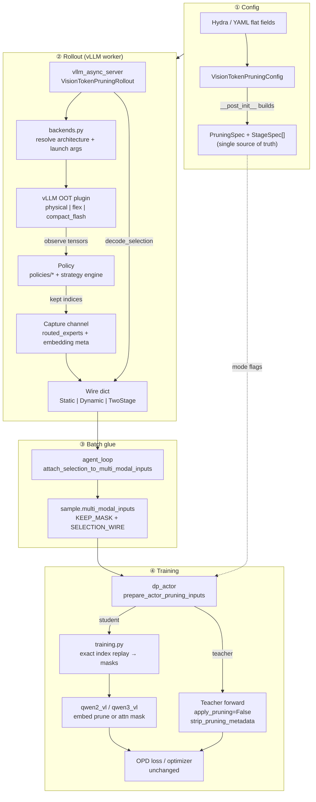
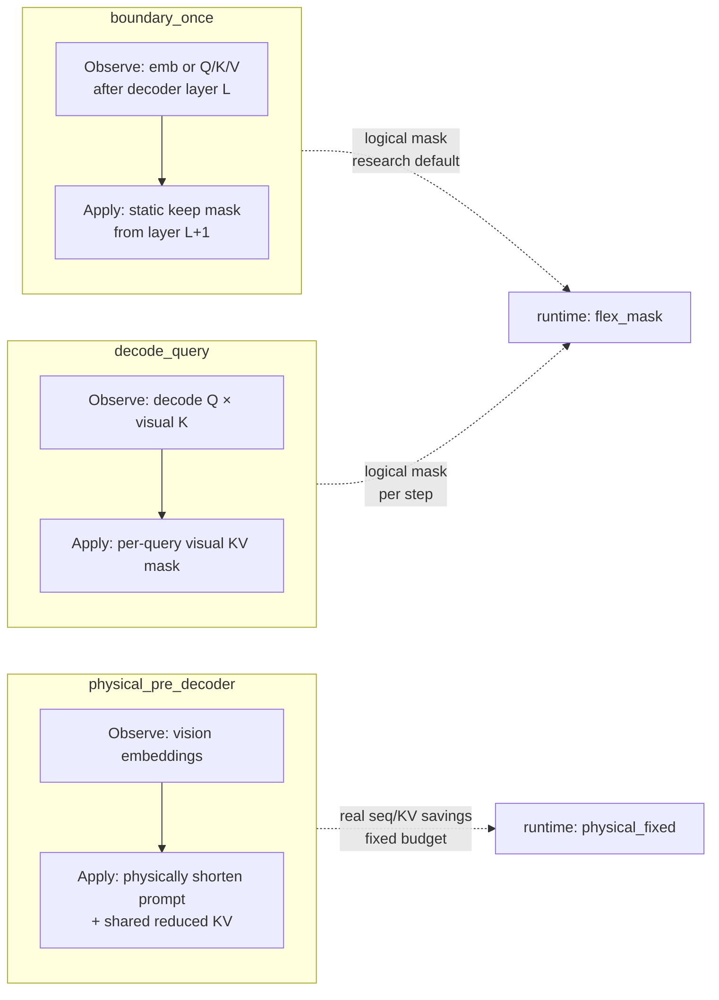
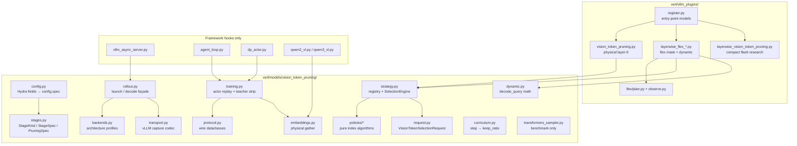
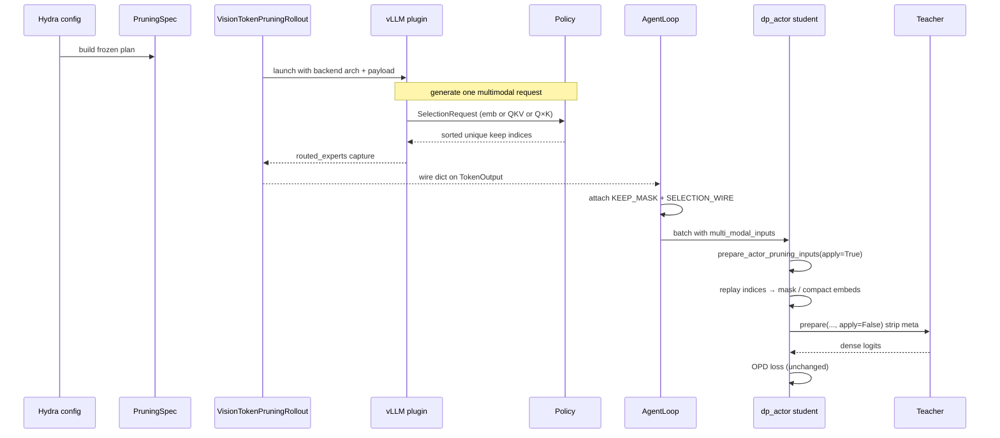
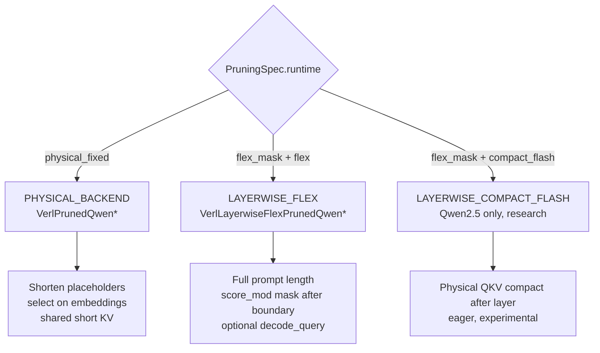
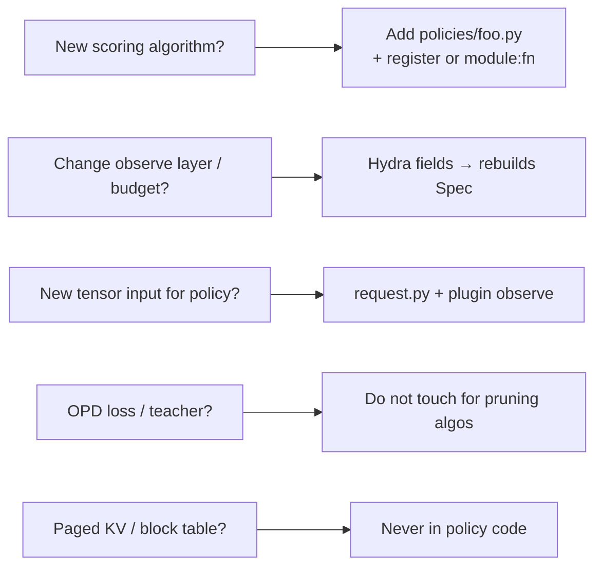

# Vision Token Pruning — Codebase Architecture

Branch: `refactor/three-stage-pruning-api`  
Principle: **one plan (`PruningSpec`), three stage kinds, exact rollout→actor replay, unpruned teacher**

---

## 1. One-sentence summary

```text
Rollout runs the policy once → wire indices travel with the sample →
actor replays the same indices → OPD teacher always sees the full image.
```

YAML/Hydra only **constructs** `PruningSpec`. Algorithms only implement **policies**.

---

## 2. End-to-end training flow



### Step notes

| Step | Owner | Does | Does **not** |
|---|---|---|---|
| ① Config | `config.py` + `stages.py` | Build frozen `PruningSpec` | Run algorithms |
| ② Rollout | plugin + `strategy` | Select once, capture indices | Train / loss |
| ③ Glue | `agent_loop` | Attach wire to sample | Re-select |
| ④ Student | `training` + qwen patches | Replay exact indices | Call policy |
| ④ Teacher | same `prepare(..., apply=False)` | Full image, no meta | Any pruning |

---

## 3. Three stage semantics



| Kind | Config signal (legacy flat) | Runtime | Real memory save? |
|---|---|---|---|
| `physical_pre_decoder` | `prune_after_layer=-1` | physical plugin | **Yes** (fixed layout) |
| `boundary_once` | `prune_after_layer=L≥0`, input emb/key | flex (or compact_flash) | No (mask only) |
| `decode_query` | `selector_input=decode_query` | flex + VisionPulse path | No (mask only) |

**Two-stage** = ordered list of two stages (e.g. physical prefill + decode_query), not a fourth kind. Wire type `TwoStageVisionTokenSelection` is the transport form of that list.

---

## 4. Package map (what each file owns)



### Role table

| Layer | Files | Responsibility |
|---|---|---|
| **Plan** | `stages`, `config` | What experiment means |
| **Algorithm** | `policies/*`, `strategy`, `request`, `dynamic` | Which tokens to keep |
| **Wire** | `protocol`, `transport` | How indices leave vLLM |
| **Rollout I/O** | `rollout`, `backends`, plugins | Launch engine, select, capture |
| **Train apply** | `training`, `embeddings`, qwen patches | Replay / strip / compact |
| **Glue** | async_server, agent_loop, dp_actor | Thin call sites (~3 hooks) |
| **Non-training** | `transformers_sampler`, compact-flash | Bench / research side path |

---

## 5. Data path detail (one sample)



### Wire shapes (current)

| Wire class | When | Payload |
|---|---|---|
| `VisionTokenSelection` | physical / boundary static | `kept_visual_indices`, fingerprint |
| `DynamicVisionTokenSelection` | decode_query only | per-query index rows |
| `TwoStageVisionTokenSelection` | prefill + decode | `prefill` + `decode` nested |

Fingerprint = SHA-256 of `(policy name, policy kwargs)`. Actor rejects mismatch (never re-runs policy).

---

## 6. Runtime backends



Constraints (fail-fast):

- Pruning capture needs **eager** vLLM (compiled graph skips Python hooks).
- Flex path disables chunked prefill / prefix cache.
- Exactly **one image**, no video.
- Cannot share `routed_experts` with routing-replay.

---

## 7. Where to change what



| Goal | Edit | Avoid |
|---|---|---|
| New algorithm | `policies/` or external `module:fn` | plugins, actor, teacher |
| Layer / ratio / curriculum | YAML → `VisionTokenPruningConfig` | hardcoding in plugins |
| Transport bug | `transport.py` only | leaking vLLM types into actor |
| Numerical check | Transformers mask path = oracle | claiming Flex curriculum = physical speedup |

---

## 8. Module size (orientation)

| Area | Approx LOC | Notes |
|---|---:|---|
| Core plan + algo + wire + train | ~2.5k | main product surface |
| Physical plugin | ~280 | stable default |
| Flex plugin | ~830 + flex/* | research hot path |
| Compact flash | ~520 | optional research |
| Transformers sampler | ~450 | offline bench only |
| Framework hooks | small | async_server / agent_loop / dp_actor / qwen |

---

## 9. Invariants (do not break)

1. **Select once in rollout**; actor only validates + replays.
2. **Teacher always dense** (`apply_pruning=False` + strip metadata).
3. **Policy is pure** over `VisionTokenSelectionRequest` → indices.
4. **Fail fast** on bad stage combo, missing schedule step, fingerprint mismatch.
5. **Numerical oracle** = Transformers attention-mask implementation.
6. **`config.spec`** is the execution plan; `uses_*` flags derive from it.

---

## 10. Related docs

| Doc | Content |
|---|---|
| `PLATFORM.md` | Short mental model |
| `ALGORITHM_GUIDE.md` | How to write a policy |
| `REFACTOR_GOALS.md` | Refactor targets + progress |
| `../vision-pruning-refactor-proposal.md` | Longer historical proposal |
