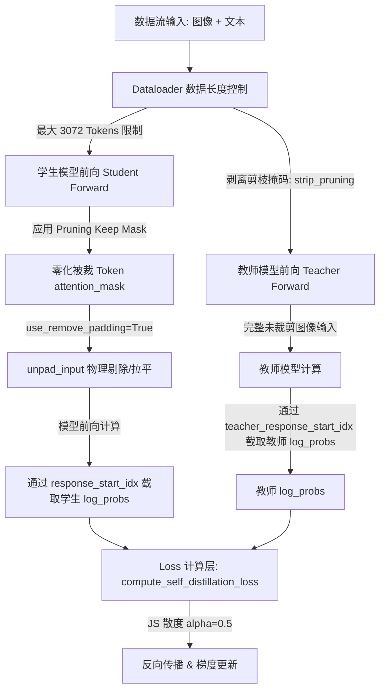

# Vision-OPD Pre-LLM 视觉 Token 剪枝项目综述文档

本设计文档旨在向团队成员汇报 **Vision-OPD (Pre-LLM 视觉 Token 剪枝)** 的核心思想、实现流程、修改后的文件结构以及 Git 分支关系，方便下一步的 Review。

---

## 1. Git 分支配置信息

* **当前修改与开发分支**：`only-prellm`（实现了加速算法与 Qwen3-VL 适配）。本分支的核心代码架构与实现流程主要基于并参考了 `refactor/three-stage-pruning-api` 分支。
* **原始代码基线分支**：`original/vision-opd`（原始未做任何剪枝和自蒸馏优化的 Vision-OPD 基准代码库）。
* **核心开发参考分支**：`refactor/three-stage-pruning-api`（之前开发的三阶段剪枝分支。该分支虽然存在一些 Bug，但是实现并编写了较完整的基于 Vision-OPD 剪枝的方法与模型框架设计，是本分支 `only-prellm` 改造和迭代的关键参考源）。

---

## 2. 项目核心思想

在多模态大语言模型（VLM）中，高分辨率图像经过 ViT 编码后会产生海量的视觉 Token（例如 ChartQA 中的图表，单图可达 3000 以上）。这使得后续 LLM 的 Self-Attention 计算在 PPO/GRPO 训练时遭遇极大的显存和吞吐瓶颈。

**本项目的核心解决思路如下**：
1. **Pre-LLM 视觉 Token 裁剪**：在视觉 Token 送入 LLM 的 Transformer 之前，通过注意力显著性或相似度度量（如 Greedy Pruning）过滤掉 50%（`keep_ratio=0.5`）的冗余视觉特征。
2. **物理剔除（无垫片加速）**：结合 Verl 的 `use_remove_padding=True` 特性，在 Dataloader 或训练时将裁剪掉的 Token 位置的 `attention_mask` 置为 `0`。底层 `unpad_input` 会将其作为占位符物理过滤，使得 Transformer 层的 Self-Attention 矩阵不再对这部分 Token 进行任何前向与反向梯度计算，实现真正的 **2x-3x 吞吐提速**。
3. **自蒸馏对齐（VOPD Loss）**：为防止剪枝带来效果骤降，引入自蒸馏机制。使用一个完全冻结的教师模型（Teacher，通常重用未裁剪的参考策略）指导被裁剪的学生模型（Student）进行 **Generalized Jensen-Shannon 散度** 蒸馏学习。

---

## 3. 具体执行流程



1. **Dataloader 阶段**：过滤长度超过 `3072` Tokens 的样本（包含展开后的图像 Token），保证显存不溢出。
2. **Student 阶段**：计算相似度矩阵（GPU 计算，CPU 循环避堵），生成 `keep_mask`；将丢弃位置的 `attention_mask` 置零，输入模型通过 `unpad_input` 缩减序列长度并前向计算，最后利用学生自身的 `response_start_idx` 截取出 `student_log_probs`。
3. **Teacher 阶段**：将输入数据通过 `strip_pruning_from_sample` 去掉剪枝标记，将完整的未裁图像送入 Teacher（重用 Reference 模型，`update_rate=0` 保持冻结），通过 `teacher_response_start_idx` 截取出 `teacher_log_probs`。
4. **损失对齐**：由于仅在 Response 段计算自蒸馏，截取出的 Log-probs 尺寸完全一致（`[batch, response_len]`）且精确对齐。最后根据 `ALPHA=0.5` 计算 JS 散度更新学生模型。

---

## 4. 修改后的文件与目录结构

下表列出了我们在当前分支 `only-prellm` 中修改和新增的关键文件及其作用：

| 修改状态 | 文件路径 | 对应功能与改动说明 |
| :--- | :--- | :--- |
| **[MODIFY]** | [qwen3_vl.py](file:///Users/test/Desktop/backup/grok/Vision-OPD-flex-attention/verl/models/transformers/qwen3_vl.py) | 适配 Qwen3-VL 的 DeepStack 架构。在 `_get_input_embeds` 和 `qwen3_vl_base_forward` 中支持了对主嵌入和多层辅助特征的并行切片裁剪。 |
| **[MODIFY]** | [sequence_compressor.py](file:///Users/test/Desktop/backup/grok/Vision-OPD-flex-attention/verl/models/vision_token_pruning/sequence_compressor.py) | 实现了 `prune_visual_embedding_outputs`，负责同步切片主图像嵌入与 DeepStack 辅助嵌入。 |
| **[MODIFY]** | [pre_llm_pruner.py](file:///Users/test/Desktop/backup/grok/Vision-OPD-flex-attention/verl/models/vision_token_pruning/pre_llm_pruner.py) | 重构了贪婪剪枝选择 `_greedy_prune_select`。将相似度计算放在 GPU 单次完成，而将多步 Pivot 循环放到 CPU 执行，**完美消除了 GPU 推理同步卡顿瓶颈**。 |
| **[MODIFY]** | [vllm_pre_llm_pruning.py](file:///Users/test/Desktop/backup/grok/Vision-OPD-flex-attention/verl/vllm_plugins/vllm_pre_llm_pruning.py) | 适配 vLLM 推理阶段。在 `_prune_and_annotate_images` 中同步对 EVS 空间/时间坐标编码（3D mRoPE）和视觉表征进行同步裁剪对齐。 |
| **[MODIFY]** | [dp_actor.py](file:///Users/test/Desktop/backup/grok/Vision-OPD-flex-attention/verl/workers/actor/dp_actor.py) | 1. 在教师端前向传播时引入 `strip_pruning_from_sample` 进行图像完整还原；<br>2. 注入被裁 Token 的 mask 零化机制，以便 `use_remove_padding` 物理剥离计算。 |
| **[NEW]** | [run_vision_opd_pruned.sh](file:///Users/test/Desktop/backup/grok/Vision-OPD-flex-attention/scripts/run_vision_opd_pruned.sh) | 专为 3B 剪枝版定制的启动脚本：ChartQA 默认数据、3B 默认模型、Prompt-3072 限制、关闭 CPU 卸载（2x 提速）、冻结教师模型（`update_rate=0.0`）。 |
| **[NEW]** | [verify_qwen2_5_real_pruning.py](file:///Users/test/Desktop/backup/grok/Vision-OPD-flex-attention/tests/verify_qwen2_5_real_pruning.py) | 针对 Qwen2.5-VL 真实 PyTorch 模型的端到端前向传播与剪枝对齐单元测试（已全部通过）。 |
| **[NEW]** | [verify_qwen3_pruning.py](file:///Users/test/Desktop/backup/grok/Vision-OPD-flex-attention/tests/verify_qwen3_pruning.py) | 针对 Qwen3-VL 的真实 PyTorch 层级（含 nn.Embedding、nn.Linear）的 DeepStack 特征剪枝单元测试（已全部通过）。 |
| **[NEW]** | [verify_batch_unpad.py](file:///Users/test/Desktop/backup/grok/Vision-OPD-flex-attention/tests/verify_batch_unpad.py) | 针对 unpad 模式下多模态批处理位置编码切片对齐的验证单元测试（已全部通过）。 |

---

## 5. 本地验证测试环境说明

为了方便在本地对视觉剪枝功能进行离线快速迭代和验证，我们定位并验证了如下环境：

* **本地虚拟环境路径**：`/Users/test/Desktop/backup/grok/visonopd-trl/.venv`
* **环境核心依赖版本**：
  * **Python**：`3.12.x`
  * **PyTorch**：`2.13.0`
  * **Transformers**：`5.3.0` (原生支持 `Qwen2_5_VLForConditionalGeneration` 及其 3D M-RoPE 位置编码结构)
* **测试运行方法**：
  在项目根目录下通过设置 `PYTHONPATH` 导入 `verl` 并指定虚拟环境的 Python 执行：
  ```bash
  # 运行 Qwen 2.5 真实模型前向传播剪枝测试
  PYTHONPATH=. /Users/test/Desktop/backup/grok/visonopd-trl/.venv/bin/python3 tests/verify_qwen2_5_real_pruning.py

  # 运行 Qwen 3 真实 PyTorch 层级剪枝测试
  PYTHONPATH=. /Users/test/Desktop/backup/grok/visonopd-trl/.venv/bin/python3 tests/verify_qwen3_pruning.py

  # 运行批处理 Unpad 位置编码对齐测试
  PYTHONPATH=. /Users/test/Desktop/backup/grok/visonopd-trl/.venv/bin/python3 tests/verify_batch_unpad.py
  ```
